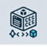

# kclnr-cli



`kclnr` is a simple command-line tool written in Go for managing Kubernetes contexts and nodes.

## Table of Contents

- [Installation](#installation)
- [Usage](#usage)
  - [Get Version](#get-version)
  - [Manage Kubeconfig Contexts](#manage-kubeconfig-contexts)
    - [List Contexts and Check Status](#list-contexts-and-check-status)
    - [List a Specific Context and Check Status](#list-a-specific-context-and-check-status)
    - [Remove a Context](#remove-a-context)
    - [Remove All Unreachable Contexts](#remove-all-unreachable-contexts)
  - [Manage Kubernetes Nodes](#manage-kubernetes-nodes)
    - [List Nodes and Check Status for All Contexts](#list-nodes-and-check-status-for-all-contexts)
    - [List Nodes and Check Status for a Specific Context](#list-nodes-and-check-status-for-a-specific-context)
- [Flags](#flags)
  - [contexts list Command](#contexts-list-command)
  - [contexts rm Command](#contexts-rm-command)
  - [contexts nodes list Command](#contexts-nodes-list-command)
- [Example](#example)
- [Dependencies](#dependencies)
- [Contributing](#contributing)
- [License](#license)

## Installation

1. Clone the repository:
   ```sh
   mkdir kclnr-cli
   cd kclnr-cli
   ```

2. Initialize the Go module:
   ```sh
   go mod init kclnr-cli
   ```

3. Install dependencies:
   ```sh
   go get -u github.com/spf13/cobra@latest
   go get k8s.io/client-go@latest
   go get github.com/olekukonko/tablewriter@latest
   go get github.com/fatih/color@latest
   ```

4. Build the tool:
   ```sh
   go build -o kclnr
   ```

## Usage

### Get Version

```sh
./kclnr version
```

This command will print the version number of the `kclnr` CLI tool.

### Manage Kubeconfig Contexts

#### List Contexts and Check Status

```sh
./kclnr contexts list
```

This command will list all available kubeconfig contexts and check their status. Reachable contexts will be displayed in green, while unreachable contexts will be displayed in red.

#### List a Specific Context and Check Status

```sh
./kclnr contexts list --context=minikube
```

This command will check the status of the specified kubeconfig context. The status will be displayed in green if reachable and red if unreachable.

#### Remove a Context

```sh
./kclnr contexts rm --name=minikube
```

This command will prompt for confirmation before removing the specified context. If the context does not exist, an error message will be displayed.

#### Remove All Unreachable Contexts

```sh
./kclnr contexts rm --all-unreachable
```

This command will prompt for confirmation before removing all unreachable contexts. If confirmed, all unreachable contexts will be removed.

### Manage Kubernetes Nodes

#### List Nodes and Check Status for All Contexts

```sh
./kclnr contexts nodes list
```

This command will list all available Kubernetes nodes and check their status for all kubeconfig contexts. Nodes that are "Ready" will be displayed in green, while nodes that are "NotReady" will be displayed in red. If there is a DNS resolution error, it will be indicated.

#### List Nodes and Check Status for a Specific Context

```sh
./kclnr contexts nodes list --context=minikube
```

This command will list all available Kubernetes nodes and check their status for the specified kubeconfig context. Nodes that are "Ready" will be displayed in green, while nodes that are "NotReady" will be displayed in red. If there is a DNS resolution error, it will be indicated.

## Flags

### `contexts list` Command

- `--context`: the name of the kubeconfig context to check (optional)

### `contexts rm` Command

- `--name`: the name of the context to remove (required unless `--all-unreachable` is used)
- `--all-unreachable`: remove all unreachable contexts

### `contexts nodes list` Command

- `--context`: the name of the kubeconfig context to check nodes status for (optional)

## Example

1. Get the version of the tool:
   ```sh
   ./kclnr version
   ```

   Output:
   ```
   kclnr version 0.15.4
   ```

2. List all available kubeconfig contexts and check their status:
   ```sh
   ./kclnr contexts list
   ```

   Output:
   ```
   +-------------+------------------------+
   |    NAME     |         STATUS         |
   +-------------+------------------------+
   | minikube    | Reachable              |
   | gke_project | Unreachable (some error message in red) |
   +-------------+------------------------+
   ```

3. Remove a specified kubeconfig context:
   ```sh
   ./kclnr contexts rm --name=minikube
   ```

   Output:
   ```
   Are you sure you want to remove the context 'minikube'? [y/N]: y
   Context minikube removed successfully.
   ```

4. Remove all unreachable kubeconfig contexts:
   ```sh
   ./kclnr contexts rm --all-unreachable
   ```

   Output:
   ```
   Are you sure you want to remove all unreachable contexts? [y/N]: y
   All unreachable contexts removed successfully.
   ```

5. List all available Kubernetes nodes and check their status for all contexts:
   ```sh
   ./kclnr contexts nodes list
   ```

   Output:
   ```
   +----------+-------------+----------+
   | CONTEXT  |  NODE NAME  |  STATUS  |
   +----------+-------------+----------+
   | minikube | node-1      | Ready    |
   | minikube | node-2      | NotReady |
   +----------+-------------+----------+
   ```

6. List all available Kubernetes nodes and check their status for a specific context:
   ```sh
   ./kclnr contexts nodes list --context=minikube
   ```

   Output:
   ```
   +----------+-------------+----------+
   | CONTEXT  |  NODE NAME  |  STATUS  |
   +----------+-------------+----------+
   | minikube | node-1      | Ready    |
   | minikube | node-2      | NotReady |
   +----------+-------------+----------+
   ```

## Dependencies

This project uses the following Go packages:
- `github.com/spf13/cobra` for command-line interface.
- `k8s.io/client-go` for interacting with Kubernetes.
- `github.com/olekukonko/tablewriter` for formatting output as a table.
- `github.com/fatih/color` for adding color to the output.

Ensure you have Go installed on your system. You can download and install it from the [official website](https://golang.org/dl/).

## Contributing

Feel free to fork this repository and submit pull requests. We welcome contributions that improve the functionality and usability of this tool.

## License

This project is licensed under the MIT License - see the [LICENSE](LICENSE) file for details.

